# Credit_Risk_Analysis

Apply Machine Learning models to predict credit risk.

## Overview

Fast Lending, a peer to peer lending services company wants to use Machine Learning to predict credit risk. The management believes that this will provide a quicker and more reliable loan experience leading to a more accurate identification of good candidates for loans which will result in lower default rates. The project aims to build and evaluate several machine learning models to predict credit risk. Credit risk is an inherently unbalanced classification problem, as good loans easily outnumber risky loans. Techniques like training, resampling and boosting are employed to make the most of the models and credit card data. 
- Oversample the data using the **RandomOverSampler** and **SMOTE** algorithms.
- Undersample the data using the **Cluster Centroids** algorithm.
- Use a combinatorial approach of over- and undersampling with the **SMOTEENN** algorithm.
- Compare **Balanced Random Forest Classifier** and **Easy Ensemble Classifier** models to reduce bias and predict credit risk.
- Evaluate the performance of each of the models and make a recommendation on whether they should be used to predict credit risk.

## Resources

- Anaconda 2022.10
- ipykernel 6.15.2
- Jupyter Notebook
- Python 3.7.13
- Pandas 1.3.5
- Scikit-learn 1.0.1
- imbalanced-learn 0.9.0
- Dataset from LendingClub 

## Results

- Scikit-learn and imbalanced-learn Python libraries are used resample the dataset and evaluate results.
- To ensure consistency between tests, a random_state of 1 is used for each sampling algorithm.
- The target of the data set, "loan status", is used to determine whether the credit application is considered "low" or "high" risk. Applications that have "current" as the "loan status" are classified as "low risk" and the remaining as "high risk". With this consideration, the dataset has a total of 68,817 applications with 99% classified as "low risk".
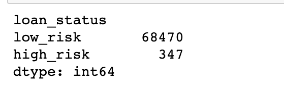

- The training and testing sets are split in 75% and 25% of total data respectively. This shows that 51,352 "low risk" and 240 "high risk" applications are categorized into the training set.
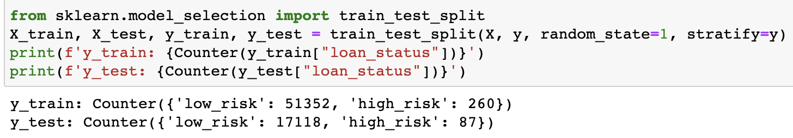

#### Naive Random Oversampling 
- Oversampling addresses class imbalance by duplicating or mimicking existing data. This model randomly selects samples (with replacement) from the minority class and adds to the training set until both minority and majority classes are balanced. As a result, both high-risk and low-risk categories count at 51,352.
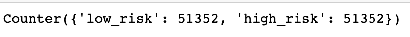

- The resampled data is then used to train a logistic regression model. The metrics generated are shown below:
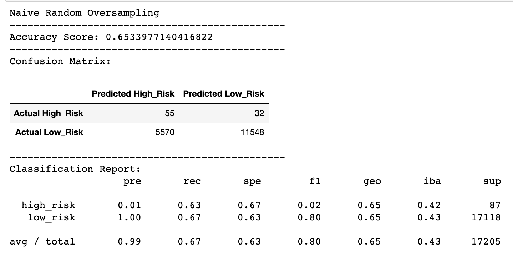

- The balanced accuracy score reads 65.34%. This shows that the model accurately predicts credit risk 62.5% of the time when the minority class is balanced by oversampling.
- There are 55 instances of "High Risk" class that are predicted correctly while 32 of "Low Risk" class are predicted falsely as "High Risk". Also, 5570 "Low Risk" applications are falsely predicted as "High Risk". The model shows a slightly better performance in identifying “Low Risk” class than a “High Risk” class. 
- The "High Risk" precision rate is 1% which means that only 1% of predicted "High Risk" applications are truly "High Risk".
- The "High Risk" recall registers 63%. That means among all predicted 5620 "High Risk" applications, only 63% are classified "High Risk". This model gives an F1 score of 0.02 (which is way less than 1).
- The "Low Risk" has a precision rate of 100% and recall at 67%. The F1 Score is at 0.8 which can conclude that this model is good at predicting "Low Risk" classes.

#### SMOTE (Synthetic Minority Oversampling Technique)
- Like Random Oversampling technique, SMOTE also increases the size of the minority class by creating new values based on the value of the closest neighbors to the minority class instead of random selection. The resampled data in minority and majority classes count at 51,352.
- Upon training a logistic regression model using the resampled data, the following metrics are generated:
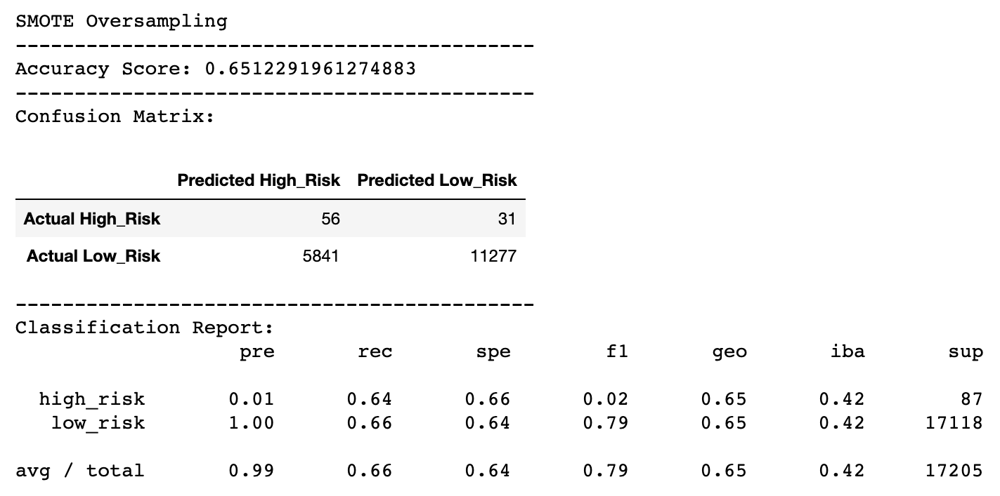

- The balanced accuracy score has recorded 65.12% which is 0.22% less than that of Naive Random Oversampler.
- Like RandomOverSampler, the "High Risk" precision rate again is only 1% with the recall move to 64% giving this model an F1 score of 2%.
- "Low Risk" class has a precision rate of 100% and decrease in recall at 66%.

#### Undersampling with Cluster Centroids algorithm
- Undersampling takes the opposite approach of oversampling. Instead of increasing the number of the minority class, the size of the majority class is decreased. Undersampling only uses actual data, which involves loss of data from the majority class. Cluster Centroids algorithm identifies clusters of the majority class, then generates synthetic data points, called centroids, that are representative of the clusters. The majority class is then undersampled down to the size of the minority class.
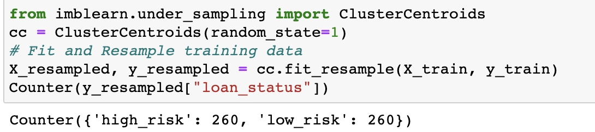

- Upon undersampling, both high-risk and low-risk categories count at 260.
- The undersampled data is then used to train a logistic regression model. The metrics generated are shown below:
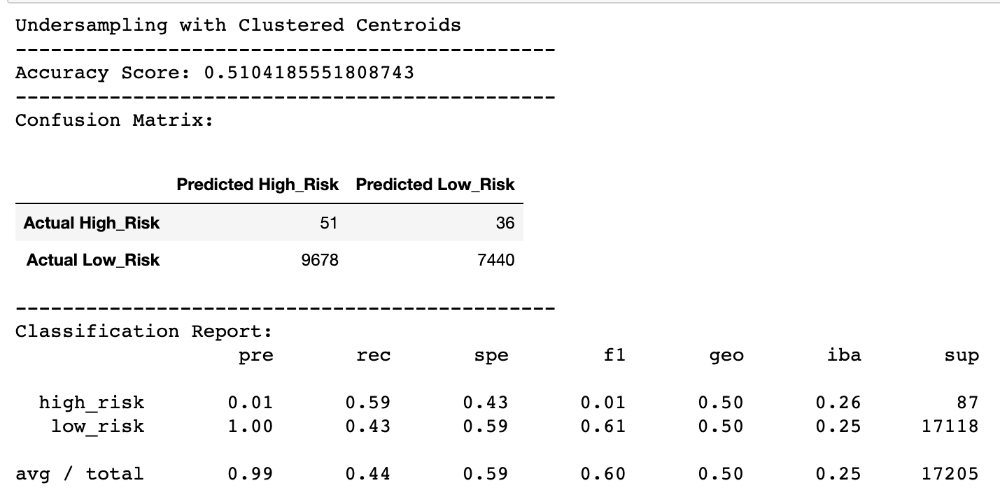

- Undersampling the majority class gives the lowest accuracy score so far at 51.04%.
- The precision scores for this model are the same as the two oversampler models.
- The recall scores for this model are also the lowest thus far. Only 59% of high risk applicants and 43% of low risk applicants are classified correctly. If used to predict risk and approve/deny accordingly, this model would classify more than half of "Low Risk" applicants as "High Risk" and nearly half of "High Risk" applicants as "Low Risk".
- The F1 score of "High Risk" instances is down to 1%.

#### Combination Sampling using SMOTEENN(Synthetic Minority Oversampling Technique + Edited NearestNeighbors) algorithm
- As with SMOTE, the minority class is oversampled; however, an undersampling step is added, removing some of each class's outliers from the dataset. The result is that the two classes are separated more cleanly. The model classified 68,458 records as High Risk and 62,022 as Low Risk.
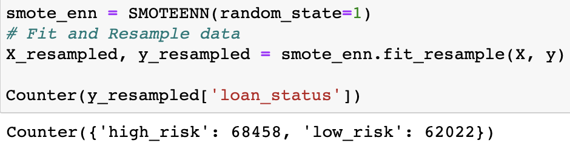

- Below are the metrics generated when resampled data is trained with a logistic regression model.
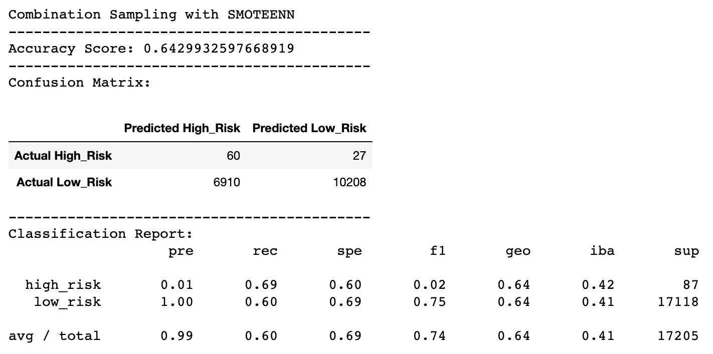

- The metrics are not greatly influenced by the combination of oversampling and undersampling, however some did show an improvement over undersampling. The balanced accuracy score improved to 64.3%.
- The "High Risk" precision remains at 1% which is same as the other models. 
- The recall increased to 69% giving this model an F1 score of 0.02. This model correctly classifies 69% of High Risk applicants and 60% of low risk applicants. 
- This model has the best sensitivity for detecting high risk applicants out of all four sampling models used thus far.

#### Ensemble Classifiers
- The two ensemble classifiers (BalancedRandomForest and EasyEnsemble) are trained with 51,366 cases as High Risk and 246 cases as Low Risk.
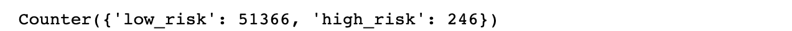

- A random state of 1 is used for each algorithm to ensure consistency between tests.
- The training data is resampled with 100 estimators.

#### Balanced Random Forest Classifier
- The Random Forest Classifier is composed of several small decision trees created from random sampling. By using the Balanced Random Forests, the following the done:
  - Draw a bootstrap sample from the minority class and randomly draw the same number of cases, with replacement, from the majority class. 
  - Induce a classification tree from the data to maximum size, without pruning. At each node, instead of searching through all
variables for the optimal split, only search through a set of randomly selected variables.
  - Repeat the two steps above for desired number of times. Aggregate the predictions of the ensemble and make the final prediction.

- With a balanced accuracy score of 78.85%, this classifier accurately predicts credit risk 78.85% of the time.
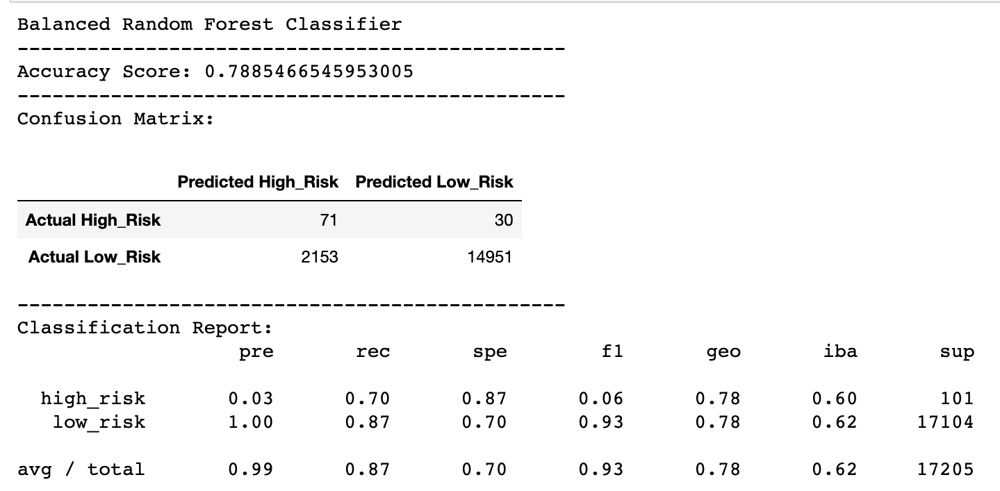

- This model has the highest precision at 3% for classifying high risk applicants compared to models built from sampling techniques alone. However, even with this precision score, the model still classifies 96% of high risk applicants as low risk. The precision score for classifying low risk applicants is same as the previous models (100%). 
- This model correctly identifies 87% of low risk applicants as low risk, and 70% of high risk applicants as high risk. At 70% recall for High Risk cases, it can be noted that score is 1% higher than the recall score from the SMOTEENN model. The high recall score for Low Risk cases makes this ensemble model a better performer than models built from sampling techniques alone.

#### Easy Ensemble AdaBoost Classifier
- The algorithm for the classifier works like below:
  - Easy Ensemble involves creating balanced samples of the training dataset by selecting all cases from the minority class and a subset from the majority class.
  - Rather than using pruned decision trees, boosted decision trees are used on each subset, specifically the AdaBoost algorithm.
  - AdaBoost works by first fitting a decision tree on the dataset, then determining the errors made by the tree and weighing the examples in the dataset by those errors so that more attention is paid to the misclassified examples and less to the correctly classified examples. A subsequent tree is then fit on the weighted dataset intended to correct the errors. The process is then repeated for a given number of decision trees.
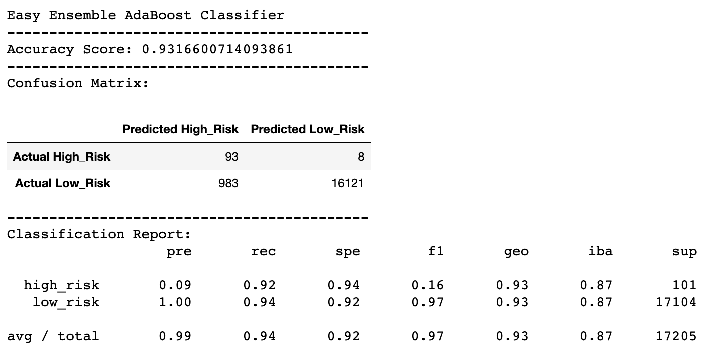

- With a balanced accuracy score of 93.12%, This model has the highest accuracy score among the models evaluated thus far.
- The precision score for correctly identifying High Risk applicants is 9%, which is the highest for all 6 models. The precision score for low risk applicants is 100%, which is the same as the other models.
- Reading the recall column, 91% of high risk and 94% of low risk applicants are correctly identified, which is the highest recall score of all the models.

## Summary

- summary of the results

- Precision is more than recall, this should be the case for loan classifiers in banking. Higher precision classifiers won’t accidentally reject a potential customer and lose the business.
The F1 Score is at 0.8 which can conclude that this model is good at predicting "Low Risk" classes.

- a recommendation on which model to use, or there is no recommendation with a justification

